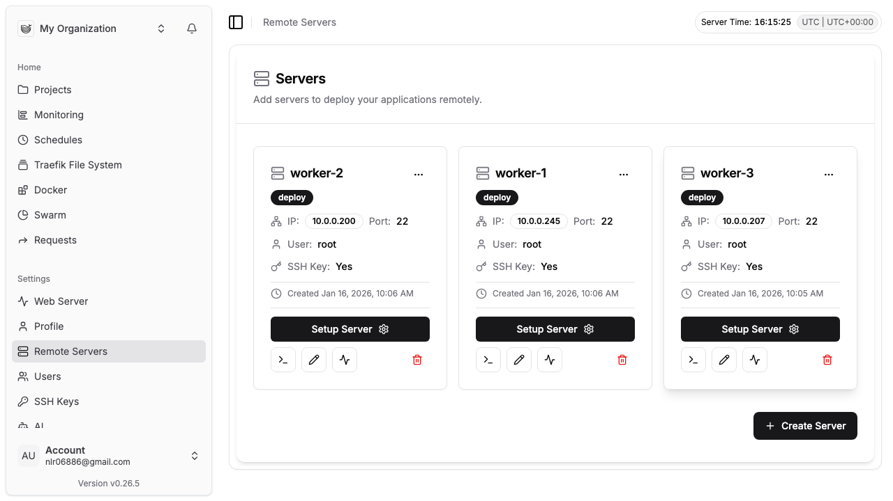
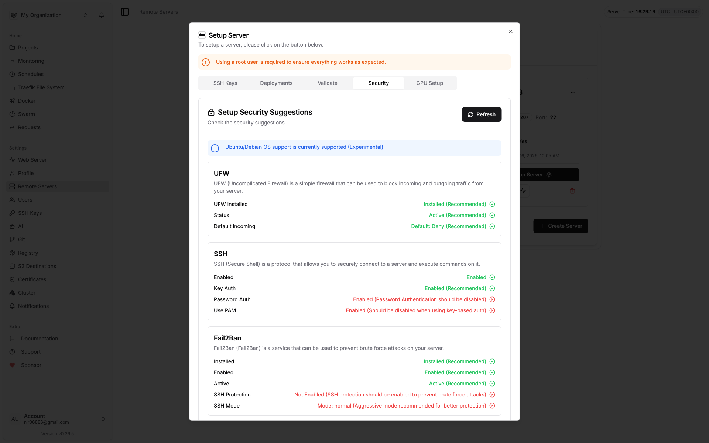

# Dokploy on OCI Free Tier

**Fully automated** Dokploy cluster deployment on Oracle Cloud Infrastructure Free Tier. No local tools required.

[](https://cloud.oracle.com/resourcemanager/stacks/create?zipUrl=https://github.com/statickidz/dokploy-oci-free/archive/refs/heads/main.zip)

## What Gets Deployed

| Component | Description |
|-----------|-------------|
| **Main Node** | Dokploy dashboard, Docker Swarm leader, Traefik reverse proxy |
| **Worker Nodes** | 1-3 Docker Swarm workers (configurable) |
| **Admin Account** | Pre-configured with your email/password |
| **API Key** | Auto-generated for programmatic access |
| **SSH Keys** | Generated and distributed to all workers |

## Automated Setup

Everything happens automatically after you click deploy:

1. Dokploy installation on main node
2. Admin account creation via API
3. API key generation
4. SSH key generation and distribution
5. Workers join Docker Swarm
6. Workers register in Dokploy dashboard

Setup takes 5-10 minutes. See [doc/ARCHITECTURE.md](doc/ARCHITECTURE.md) for workflow diagrams.

## After Deployment

Credentials appear in the stack job outputs:

```
Dashboard: http://MAIN_IP:3000/
Email:     your-email@example.com
Password:  TEMPORARY_PASSWORD
```

⚠️ **Change your password immediately** after first login:  
Dashboard → Settings → Profile → Change Password

## Configuration

### Required Variables

| Variable | Description |
|----------|-------------|
| `ssh_authorized_keys` | Your SSH public key for instance access |
| `compartment_id` | OCI compartment ID |
| `dokploy_admin_email` | Admin email for Dokploy |

### Optional Variables

| Variable | Default | Description |
|----------|---------|-------------|
| `dokploy_admin_password` | Auto-generated | Admin password |
| `num_worker_instances` | 3 | Number of workers (0-3) |
| `instance_shape` | VM.Standard.A1.Flex | Instance shape |
| `memory_in_gbs` | 6 | Memory per instance |
| `ocpus` | 1 | OCPUs per instance |

## Security Hardening

All nodes are automatically hardened with:

| Security Layer | Configuration |
|----------------|---------------|
| **UFW Firewall** | Active, default deny incoming |
| **SSH** | Key-only auth, password disabled |
| **Fail2Ban** | Enabled with SSH jail (bantime=1hr, maxretry=3) |

### Workers Pre-configured



### Security Status in Dokploy



### Known Issues

Dokploy's security audit (v0.26.x) has [known bugs](https://github.com/Dokploy/dokploy/issues/1377) that may show false warnings:

| Reported Issue | Actual Status |
|----------------|---------------|
| "Password Auth Enabled" | **False positive** - disabled via `PasswordAuthentication no` |
| "UsePAM Enabled" | Expected - required for Ubuntu cloud-init SSH |
| "SSH Protection Not Enabled" | **False positive** - Fail2Ban sshd jail is active |

Verify actual config via SSH: `ssh ubuntu@MAIN_IP 'sudo sshd -T | grep passwordauth'`

## Documentation

- [Architecture & Workflow](doc/ARCHITECTURE.md) - Sequence diagrams, component architecture
- [Dokploy Feature Request](doc/DOKPLOY_FEATURE_REQUEST.md) - Headless admin initialization proposal

## Project Structure

```
├── bin/                  # Helper scripts (stack.sh)
├── doc/                  # Documentation
├── templates/            # Cloud-init templates (.sh.tpl)
├── *.tf                  # Terraform configuration
└── README.md
```

## About

### Dokploy


Open-source deployment tool for managing servers, applications, and databases. Visit [dokploy.com](https://dokploy.com).

### OCI Free Tier

Oracle Cloud offers ARM-based VM.Standard.A1.Flex instances ideal for Dokploy. See [OCI Free Tier](https://www.oracle.com/cloud/free/).

**Note**: Free Tier is subject to availability. Upgrade to paid (keeps free benefits) to bypass capacity limits.

## License

MIT
