# Dokploy OCI Free Tier - Architecture & Automation

This document describes the fully automated end-to-end deployment workflow that provisions Dokploy on Oracle Cloud Infrastructure without requiring any local tools or manual intervention.

## Overview

The deployment is 100% automated via OCI Resource Manager. Users configure variables in the web UI, click deploy, and receive a fully operational Dokploy cluster with:

- Admin account pre-configured
- API key generated
- SSH keys created and distributed
- Workers joined to Docker Swarm
- Workers registered in Dokploy

## Deployment Sequence

```mermaid
sequenceDiagram
    autonumber
    participant User
    participant OCI as OCI Resource Manager
    participant Main as Main Node
    participant Token as Token Server (port 9999)
    participant Dokploy as Dokploy API
    participant W1 as Worker 1
    participant W2 as Worker 2
    participant W3 as Worker 3

    User->>OCI: Configure variables & Deploy
    OCI->>Main: Create instance + cloud-init
    OCI->>W1: Create instance + cloud-init
    OCI->>W2: Create instance + cloud-init
    OCI->>W3: Create instance + cloud-init

    rect rgb(40, 44, 52)
        Note over Main: Main Node Setup (3-5 min)
        Main->>Main: Install Docker
        Main->>Main: Initialize Swarm (leader)
        Main->>Main: Install Dokploy
        Main->>Dokploy: POST /auth/sign-up (create admin)
        Dokploy-->>Main: Session cookie
        Main->>Dokploy: GET organization.all
        Dokploy-->>Main: organizationId
        Main->>Dokploy: POST user.createApiKey
        Dokploy-->>Main: API key
        Main->>Main: Generate SSH keypair
        Main->>Dokploy: POST sshKey.create
        Main->>Dokploy: GET sshKey.all (get sshKeyId)
        Dokploy-->>Main: sshKeyId
        Main->>Main: Save credentials to /opt/dokploy-credentials.json
        Main->>Token: Start HTTP server on :9999
    end

    rect rgb(34, 40, 49)
        Note over W1,W3: Workers Setup (parallel, 2-4 min)
        
        loop Poll until ready (max 10min intervals)
            W1->>Token: GET /token
            Token-->>W1: swarm join command
        end
        W1->>Main: docker swarm join
        
        W1->>Token: GET /credentials
        Token-->>W1: {api_key, ssh_key_id, public_key}
        W1->>W1: Add public key to /root/.ssh/authorized_keys
        W1->>Dokploy: POST server.create (register self)
        Dokploy-->>W1: serverId
        W1->>W1: Touch /opt/dokploy-worker-setup-complete
        
        Note over W2,W3: Workers 2 & 3 follow same flow
    end

    OCI-->>User: Outputs: Dashboard URL, Email, Password
```



## Component Architecture


## Key Implementation Details

### Token Server (Manager)

The main node runs a lightweight HTTP server on port 9999 that serves credentials to workers:

| Endpoint | Returns |
|----------|---------|
| `/token` | `docker swarm join --token SWMTKN-xxx MANAGER_IP:2377` |
| `/credentials` | `{api_key, ssh_key_id, public_key, ...}` |
| `/public-key` | SSH public key for worker authorization |

**Implementation**: Python `http.server` serving static files from `/opt/api/`, refreshed every 10 seconds.

### Dokploy API Integration

The automation uses these tRPC endpoints:

| Step | Endpoint | Purpose |
|------|----------|---------|
| 1 | `POST /api/auth/sign-up/email` | Create admin account |
| 2 | `POST /api/auth/sign-in/email` | Login, get session cookie |
| 3 | `GET organization.all` | Get organizationId (required for API key) |
| 4 | `POST user.createApiKey` | Generate API key with organizationId in metadata |
| 5 | `POST sshKey.create` | Register SSH keypair with organizationId |
| 6 | `GET sshKey.all` | Fetch sshKeyId (create returns null) |
| 7 | `POST server.create` | Register worker server (workers call this) |

### Worker Registration Flow


### Duplicate Prevention

Workers check for `/opt/dokploy-worker-setup-complete` at startup. If present, the setup script exits immediately, preventing duplicate server registrations.

### Retry Strategy

| Component | Delay | Max Delay | Stops? |
|-----------|-------|-----------|--------|
| Worker polling manager | +30s per attempt | 10 minutes | Never |
| Manager waiting for Dokploy | +5s per attempt | 60 seconds | After 60 attempts |

## Security Hardening

All nodes include:

- **UFW Firewall**: Only required ports open (22, 80, 443, 2377, 3000, 9999)
- **SSH Hardening**: Key-only auth, no password/PAM
- **Fail2Ban**: Brute force protection
- **Swarm Encryption**: TLS for inter-node communication

## Terraform Outputs

After deployment, OCI Resource Manager displays:

```
dokploy_dashboard_url = "http://MAIN_IP:3000/"
dokploy_admin_email = "user@example.com"
dokploy_admin_password = "TEMPORARY_PASSWORD"  # CHANGE IMMEDIATELY!
worker_nodes = {
  "worker-1" = { public_ip = "x.x.x.x", private_ip = "10.0.0.x" }
  "worker-2" = { public_ip = "x.x.x.x", private_ip = "10.0.0.x" }
  "worker-3" = { public_ip = "x.x.x.x", private_ip = "10.0.0.x" }
}
```

## Troubleshooting

### Check Main Node Setup
```bash
ssh ubuntu@MAIN_IP 'cloud-init status && sudo cat /opt/dokploy-credentials.json | jq .'
```

### Check Worker Status
```bash
ssh ubuntu@WORKER_IP 'cloud-init status && cat /var/log/dokploy-worker-setup.log'
```

### Verify Swarm Cluster
```bash
ssh ubuntu@MAIN_IP 'sudo docker node ls'
```

### Verify Dokploy Servers
```bash
ssh ubuntu@MAIN_IP 'API_KEY=$(sudo cat /opt/dokploy-credentials.json | jq -r .api_key); curl -s "http://localhost:3000/api/trpc/server.all?batch=1&input=%7B%220%22%3A%7B%22json%22%3Anull%7D%7D" -H "x-api-key: $API_KEY" | jq ".[0].result.data.json"'
```
